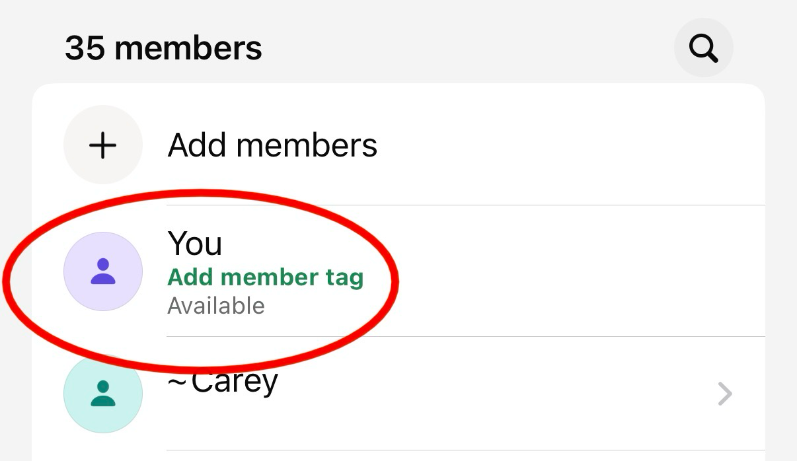
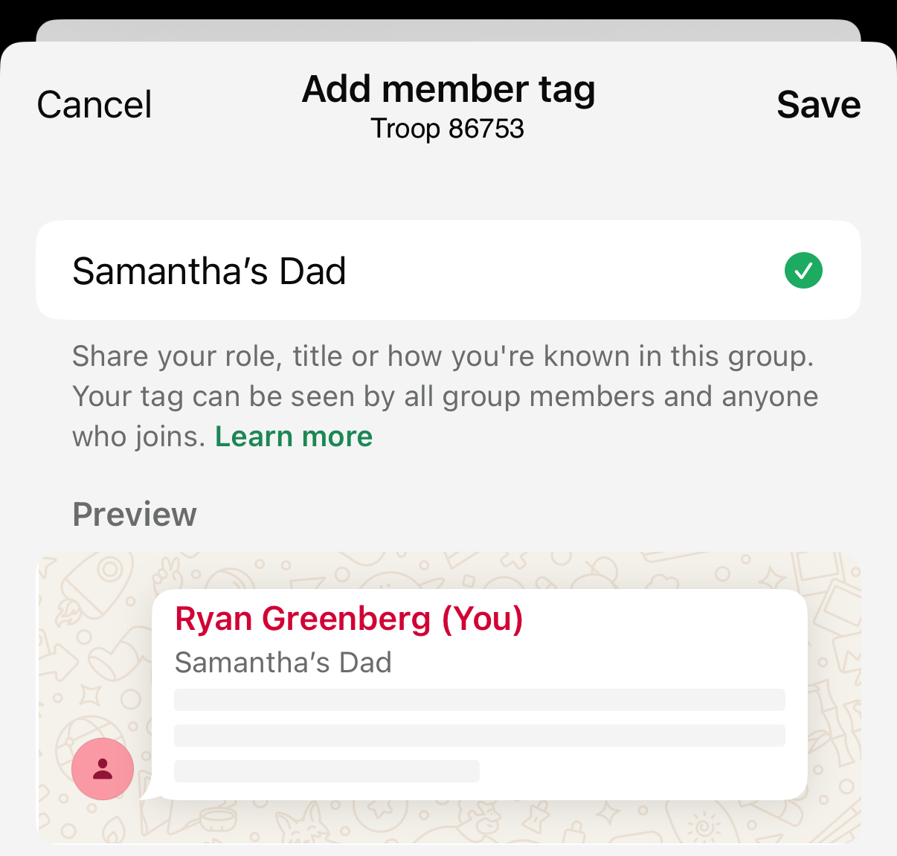

# WhatsApp has per-conversation member tags

I'm part of several WhatsApp chats for my kids: one for each class, one for each activity. Each of them is filled with dozens of parents and in many cases I want to know "whose parent are you?" Some parents actually change their name to include their children's names. This morning in one of the chats I saw one parent's name and underneath "Daniel's Mom". What's that?!

It's a new-ish feature launched in January 2026: member tags. You can set a description that appears alongside your name for each individual conversation. This way in the soccer chat I can mark myself as a coach, and in each classroom chat I can mark myself as the relevant child's parent.

Scroll to the members section of the chat details, then tap "Add member tag" to edit.

More details on the [support page](https://faq.whatsapp.com/1342437846952487/?cms_platform=iphone&helpref=platform_switcher) (which is blank for "Web"; presumably the feature isn't available there yet).
