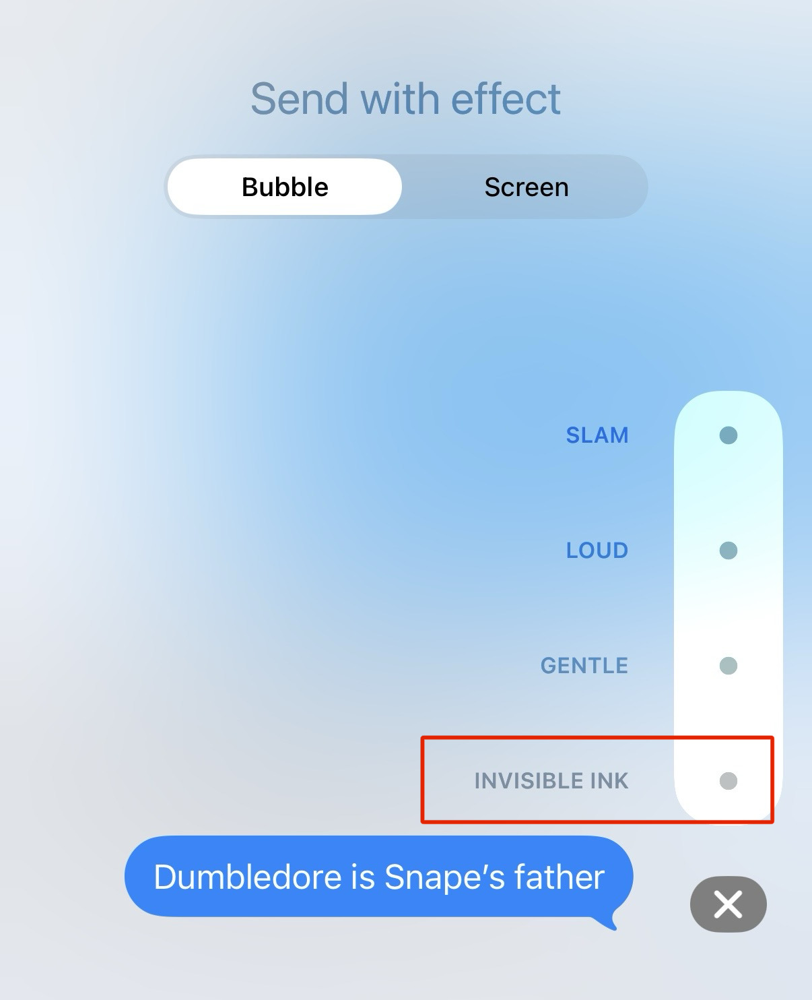

# Use "Invisible Ink" for spoilers in iMessage

Earlier this week I remarked to a friend that I wish iMessage had spoiler formatting like Discord. They responded

What!? Woah!

I used to be on the vanguard of new features in MacOS/iOS but maybe that day has past. To send a message with this effect (which applies to the entire message, not selectively), you long press on the send button and select the "Invisible Ink" effect.

It also works on pictures.
