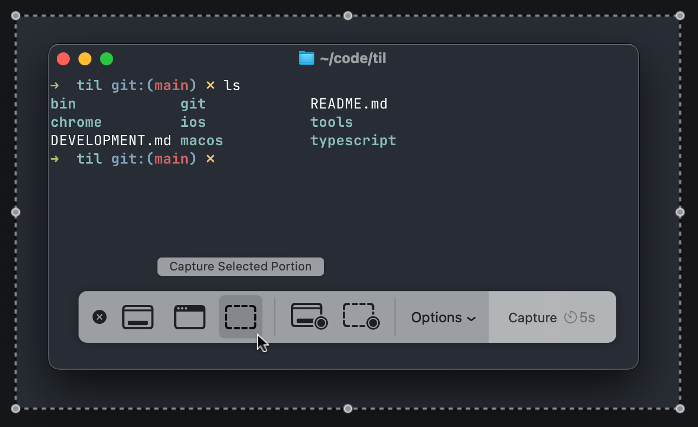

# `cmd + shift + 5` is the final screenshot command

I have used Macs forever and at one point I took a lot of pride in the sheer number of keyboard shortcuts I had memorized.

- `cmd + shift + 3` for a full-screen screenshot
- `cmd + shift + 4` for a region
  - press spacebar to switch to object mode (capture a window, menu, etc.)
  - less useful, but shift and option change drag mode
- in both modes, hold control to capture to clipboard

Today I discovered `cmd + shift + 5` which basically turns knowledge of all these shortcuts into a nice UI:



You can capture the entire screen, a region, or a UI element. The Options menu lets you choose where to save it (including the clipboard), set a timer, show or hide the cursor. You can even record a movie!

As a bonus: if you need to take a screenshot of the screenshot controls, you can use the `screencapture` command:

```
screencapture -C -T10 ~/Desktop/screencapture_$(date +%s).png
```

`-C` shows the cursor, `-T10` gives you a 10-second delay.
