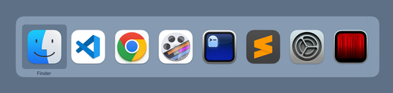

# `cmd + tab` has a bunch of extras

On macOS `cmd + tab` brings up the application switcher. "Yes," you say, "I have used a computer before."

But there are a bunch of extras!

- if you keep the cmd key depressed, you can use `tab`, `shift + tab`, `~`, the left/right arrow keys, or even the mouse to select the application to activate.
- press `q` when an application is selected to quit the program
- press `h` when an application is selected to hide it
- press up/down when an application is selected to show all its windows in an Exposé view
- if you are dragging a file, you can drop it onto an icon in the switcher (I can't say I've ever used this one. I typically drag-and-drop to the Dock but maybe there are cases where the application switcher is more convenient)
