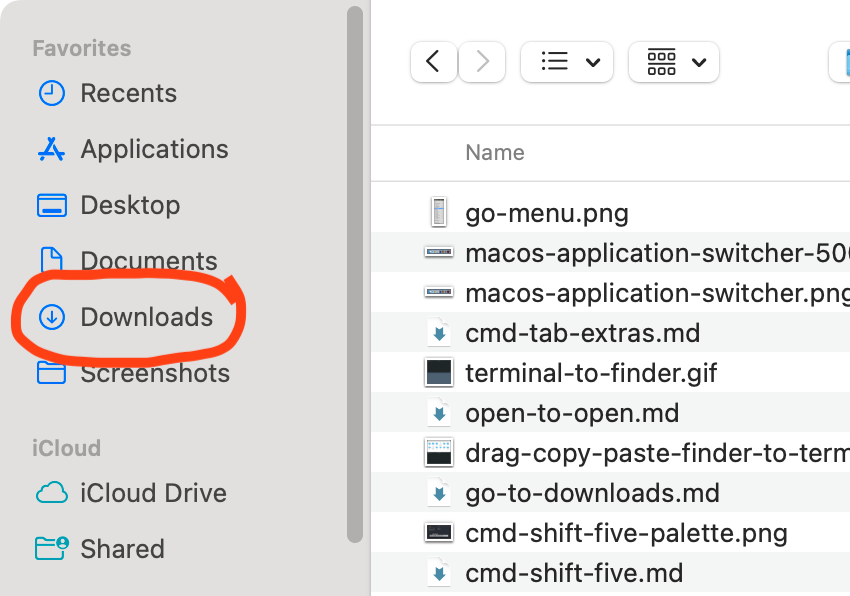
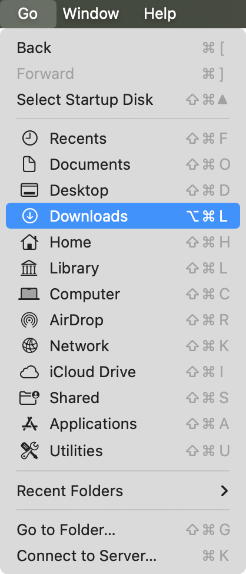

# `cmd + option + L` to navigate to Downloads

For _years_--maybe decades--I have repeated these steps when facing an open/save dialog box to select a file.

If the file I want is on the Desktop, I use `cmd + shift + D` to navigate there. If it's in my Downloads folder, which is common, I use this keyboard Rube Goldberg machine:

- Press `cmd + shift + H` to navigate to my home directory
- Start typing "Dow" to select Downloads
- Press `cmd + down` to open the selected folder.

"Ryan," you might say gently, "There's a button right there. You know you could just click it?"

The heart wants what it wants (to keep its hands on the keyboard).

Every shortcut listed in the Finder's Go menu also works in Open/Save dialog boxes.

I must have missed `cmd + option + L` (presumably for down**L**oads). Now I use it all the time.
