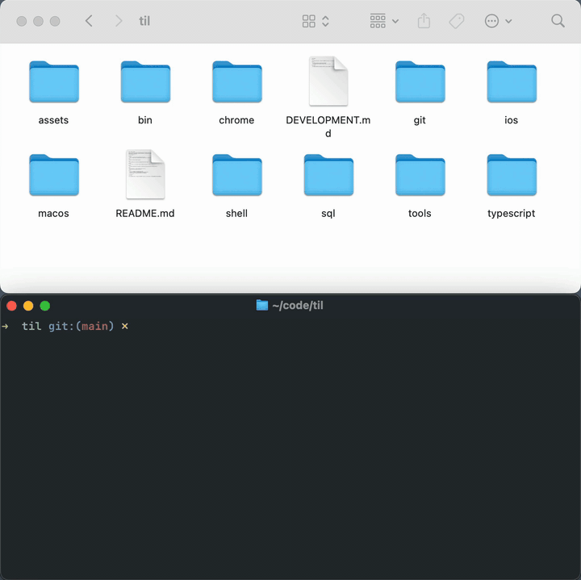

# Use `open` to open in other applications

The `open` command on the macOS CLI lets you open things in another application. By default, it uses the application that corresponds to the file type as determined by LaunchServices. You can specify a different one with `-a`:

```sh
open index.html # opens in Chrome, my default application for *.html
open -a "Sublime Text" index.html
open -a "Safari" index.html
```

One great use for this is with directories. The Finder is the default application for them, which means you can easily open your current directory in the Finder with `open .` (some things are easier in a GUI!) .


If you need to go the other direction (Finder to terminal), you can drag a file into the terminal window or copy/paste it.



