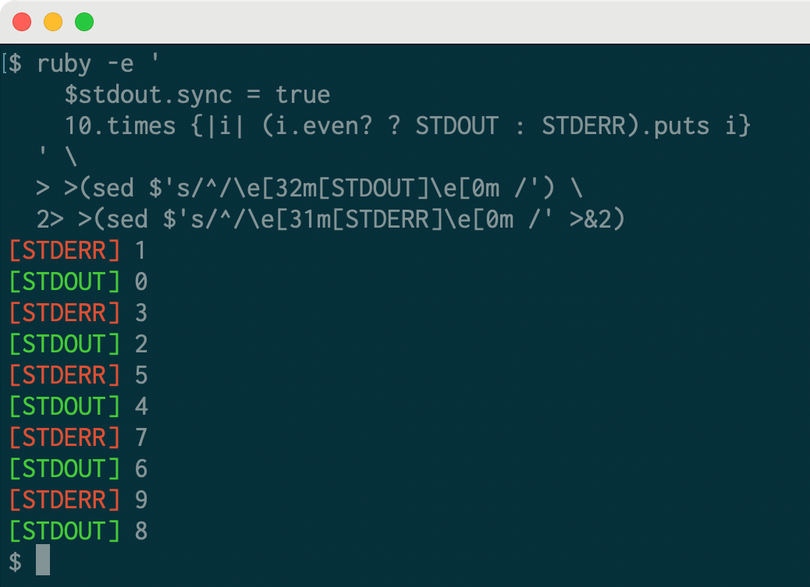

# Use process substitution to tag stdout and stderr

I learned something new about shells today! You can use `>(...)` to write output to another process.

You are almost certainly familiar with command substitution: `ls -l $(which git)` runs `which git` first and substitutes that as an argument to `ls -l` (you can also use backticks but they can't be nested like `$(..)`).

You might know about `<(...)` which lets you turn the output of a command into a pseudo file. This is [_process_ substitution](https://en.wikipedia.org/wiki/Process_substitution). It's helpful for commands that only operate on files. For example `diff`, which compares two files:

```sh
diff <(printf "abc\ndef\n") <(printf "abc\n123\ndef\n")
1a2
> 123
```

The way this works is that the output of `<(cmd)` becomes a file descriptor:

```
$ ls -l <(echo "abc")
prw-rw---- 0 ryan staff 8 Jan 28 11:21 /dev/fd/11
```

The `p` that you see in the ls output indicates that this is a pipe or "FIFO"; on Linux you'll see slightly different output. Not all commands play nicely with these fds, zsh provides `=(...)` which writes the output to an actual temporary file:

```
ls -l =(echo "abc")
-rw------- 1 ryan wheel 8 Jan 28 11:22 /tmp/zshAnZjWQ
```

I wrote all of this up for the #cli-pro-tips channel I created at Slack many years ago (and rewrote it now because I did not put the content I wrote for that channel anywhere else--I wish I had started recording TILs long ago!).

Today I learned there is an entirely new way to compose this: `>(...)`

```
<(command)   # read from command's stdout
>(command)   # write to command's stdin
```

Specifically, I was wondering how I could tag the output of a command as going to stderr vs stdout without writing something that wraps the whole command. It turns out it's easy with this technique.

Here's a Ruby command that writes even numbers to stdout, odd numbers to stderr. By default, you can't tell what is going where:

```sh
ruby -e '10.times {|i| (i.even? ? STDOUT : STDERR).puts i}'
0
1
2
3
4
5
6
7
8
9
```

You can redirect stdout and stderr to a program that will read the input and append the source.

```sh
ruby -e '$stdout.sync = true; 10.times {|i| (i.even? ? STDOUT : STDERR).puts i}' \
  > >(sed $'s/^/[STDOUT] /') \     # write stdout to one sed program
  2> >(sed $'s/^/[STDERR] /' >&2)  # write stderr to another
[STDOUT] 0
[STDERR] 1
[STDOUT] 2
[STDERR] 3
[STDERR] 5
[STDOUT] 4
[STDERR] 7
[STDOUT] 6
[STDOUT] 8
[STDERR] 9
```

Here `> >(sed $'s/^/[STDOUT] /')` redirects stdout to one sed program, and
`2> >(sed $'s/^/[STDERR] /' >&2)` redirects stderr to another.

(I added `$stdout.sync = true` to this example because it circumvents some output buffering that is a whole separate discussion.)

Here's a version that's harder to read but nice because it uses colors:

```sh
ruby -e '
    $stdout.sync = true;
    10.times {|i| (i.even? ? STDOUT : STDERR).puts i}' \
  > >(sed $'s/^/\e[32m[STDOUT]\e[0m /') \
  2> >(sed $'s/^/\e[31m[STDERR]\e[0m /' >&2)
```



The uses for this technique seem pretty limited because in almost every other case I can imagine you would be better off with a regular pipe.
